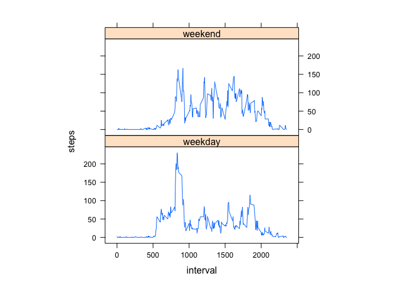

# Reproducible Research: Peer Assessment 1


## Loading and preprocessing the data


```r
unzip("activity.zip")
activityDs <- read.csv("activity.csv")
```

## What is mean total number of steps taken per day?

1. Make a histogram of the total number of steps taken each day


```r
dailyTotalSteps <- aggregate(steps ~ date, data = activityDs, sum, na.rm = TRUE)
hist(dailyTotalSteps$steps, main = "Histogram of the total steps taken each day", xlab="Total steps taken each day",)
```

 

2. Calculate and report the **mean** and **median** total number of steps taken per day


```r
mean(dailyTotalSteps$steps)
```

```
## [1] 10766.19
```

```r
median(dailyTotalSteps$steps)
```

```
## [1] 10765
```

## What is the average daily activity pattern?

1. Make a time series plot (i.e. `type = "l"`) of the 5-minute interval (x-axis) and the average number of steps taken, averaged across all days (y-axis)


```r
intervalAverageSteps <- aggregate(steps ~ interval, data = activityDs, mean, na.rm = TRUE)
plot(intervalAverageSteps, type="l")
```

 

2. Which 5-minute interval, on average across all the days in the dataset, contains the maximum number of steps?


```r
intervalAverageSteps$interval[which.max(intervalAverageSteps$steps)]
```

```
## [1] 835
```

## Imputing missing values

1. Calculate and report the total number of missing values in the dataset (i.e. the total number of rows with `NA`s)


```r
sum(is.na(activityDs))
```

```
## [1] 2304
```

2. Devise a strategy for filling in all of the missing values in the dataset. The strategy does not need to be sophisticated. For example, you could use the mean/median for that day, or the mean for that 5-minute interval, etc.

I will use the mean for the 5-minute intervals to fill in the missing values in the dataset. First, create function **"getMeanInterval"** to get the mean for that 5-minute interval.


```r
getMeanInterval <- function(interval) {
    intervalAverageSteps[intervalAverageSteps$interval == interval, ]$steps
}
```

3. Create a new dataset that is equal to the original dataset but with the missing data filled in.


```r
activityDsNew <- activityDs
for (i in 1:nrow(activityDsNew)) {
    if (is.na(activityDsNew[i, ]$steps)) {
        # Fill in missing values with the mean for that 5-minute interval
        activityDsNew[i, ]$steps <- getMeanInterval(activityDsNew[i, ]$interval)
    }
}
```

4. Make a histogram of the total number of steps taken each day and Calculate and report the **mean** and **median** total number of steps taken per day. Do these values differ from the estimates from the first part of the assignment? What is the impact of imputing missing data on the estimates of the total daily number of steps?


```r
dailyTotalStepsNew <- aggregate(steps ~ date, data = activityDsNew, sum, na.rm = TRUE)
hist(dailyTotalStepsNew$steps, main = "Histogram of the total steps taken each day", xlab="Total steps taken each day",)
```

 

```r
mean(dailyTotalStepsNew$steps)
```

```
## [1] 10766.19
```

```r
median(dailyTotalStepsNew$steps)
```

```
## [1] 10766.19
```

The **mean** is similar to the first part of the assignment. The **median** is slightly higher than the first part of the assignment. Inputing missing data generally increases the estimates of the total daily number of steps as seen from the new histogram that some buckets are higher than the first part of the assignment.

## Are there differences in activity patterns between weekdays and weekends?

1. Create a new factor variable in the dataset with two levels - "weekday" and "weekend" indicating whether a given date is a weekday or weekend day.


```r
# weekend = Saturday and Sunday; weekday = Monday to Friday
activityDsNew$day = ifelse(as.POSIXlt(as.Date(activityDsNew$date))$wday%%6 == 0, "weekend", "weekday")
activityDsNew$day = factor(activityDsNew$day, levels = c("weekday", "weekend"))
```

2. Make a panel plot containing a time series plot (i.e. `type = "l"`) of the 5-minute interval (x-axis) and the average number of steps taken, averaged across all weekday days or weekend days (y-axis).


```r
library(lattice)
intervalAverageStepsNew = aggregate(steps ~ interval + day, activityDsNew, mean)
xyplot(steps ~ interval | factor(day), data = intervalAverageStepsNew, aspect = 1/2, type = "l")
```

 
